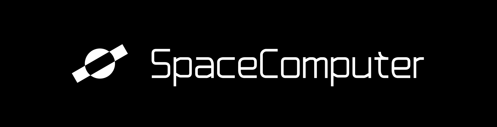

# SpaceComputer Brand & Media Kit

Welcome to the official SpaceComputer brand repository. This kit contains all assets needed to represent SpaceComputer consistently across different platforms and media formats.

## Brand Colors

| Color | Hex Code |
|-------|----------|
| Black | #000000 |
| White | #FFFFFF |
| Text Secondary | #A7A7A7 |
| Yellow | #FDD400 |
| Background | #121003 |

## Assets Overview

All assets are available in both vector (SVG) and raster (PNG) formats to ensure high-quality representation in any context.

### Asset Types Explained

- **Logomark**: The standalone SpaceComputer symbol/icon without text
- **Horizontal**: The full SpaceComputer logo with text and symbol arranged horizontally
- **Light/Dark/Yellow**: Color variants optimized for different backgrounds and usage scenarios

### File Structure

```
/logo
  /png
    - SpaceComputer_horizontal_dark.png    (Full logo with text on light backgrounds)
    - SpaceComputer_horizontal_light.png   (Full logo with text on dark backgrounds)
    - SpaceComputer_horizontal_yellow.png  (Full logo with text in yellow variant)
    - SpaceComputer_Logomark_dark.png      (Symbol only for light backgrounds)
    - SpaceComputer_Logomark_light.png     (Symbol only for dark backgrounds)
    - SpaceComputer_Logomark_yellow.png    (Symbol only in yellow variant)
    - SpaceComputer_banner.png             
  /svg
    - SpaceComputer_horizontal_dark.svg    (Vector full logo for light backgrounds)
    - SpaceComputer_horizontal_light.svg   (Vector full logo for dark backgrounds)
    - SpaceComputer_horizontal_yellow.svg  (Vector full logo in yellow)
    - SpaceComputer_Logomark_dark.svg      (Vector symbol for light backgrounds)
    - SpaceComputer_Logomark_light.svg     (Vector symbol for dark backgrounds)
    - SpaceComputer_Logomark_yellow.svg    (Vector symbol in yellow)
```

## Usage Guidelines

### Logo Usage

Our brand identity consists of two key elements:
- **Logomark**: The distinctive SpaceComputer symbol that can be used on its own when space is limited or the brand is already well understood in context
- **Horizontal Logo**: The complete logo with the SpaceComputer name and symbol side by side for primary brand identification

### When to Use Each Asset

- **Logomark**: Use for app icons, favicons, social media profiles, or when space is limited
- **Horizontal Logo**: Use as the primary logo for most applications including websites, marketing materials, and documentation
- **Banner**: Use for social media headers, email signatures, or promotional materials
- **Dark Variants**: Use on light backgrounds (white or light colors)
- **Light Variants**: Use on dark backgrounds (black or dark colors)
- **Yellow Variants**: Use for high-impact applications or when you want to emphasize the brand

### Clear Space

Always maintain adequate clear space around the logo to ensure visibility and impact. The minimum clear space should be equivalent to the height of the logomark on all sides.

### Size Requirements

To maintain legibility, never display the logo smaller than:
- 24px height for digital use
- 8mm height for print applications

### Do's and Don'ts

✅ **Do**:
- Use the provided files without modification
- Maintain the logo's proportions when scaling
- Use the appropriate color variant for your background
- Maintain adequate clear space around the logo

❌ **Don't**:
- Distort or stretch the logo
- Change the logo colors outside of the provided variants
- Add effects such as shadows, outlines, or gradients
- Place the logo on busy backgrounds that reduce visibility
- Rotate or reposition elements of the logo

## Applications

### Website & Digital

For digital applications, SVG format is recommended for optimal scaling and quality. Use the horizontal logo in headers and primary branding areas, and the logomark for favicon and mobile applications.

### Print

For print applications, high-resolution PNG files are suitable. Ensure the logo is sized appropriately for the medium. For large format printing, SVG files can be converted to appropriate formats by your print provider.

### Social Media

Profile pictures: Use the logomark (square format) variants.
Headers and banners: Use the horizontal logo or banner formats depending on the platform requirements.

---

For questions about SpaceComputer brand usage or to request additional assets, please open an issue in this repository.